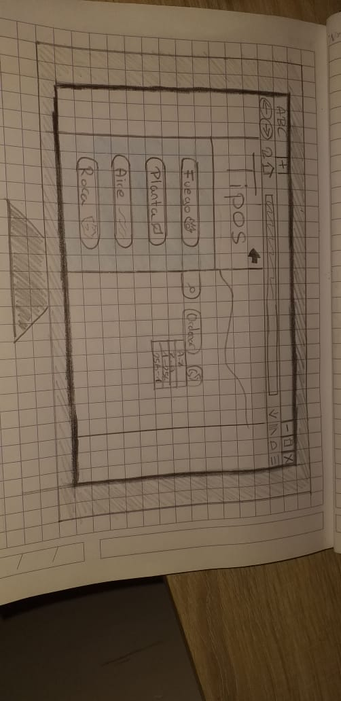
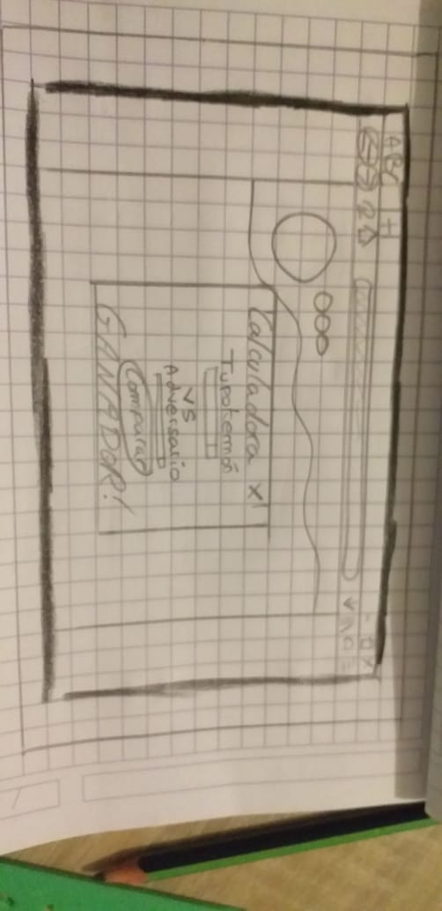
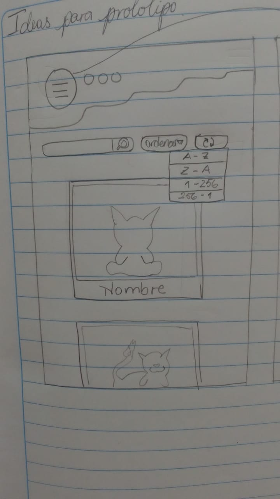
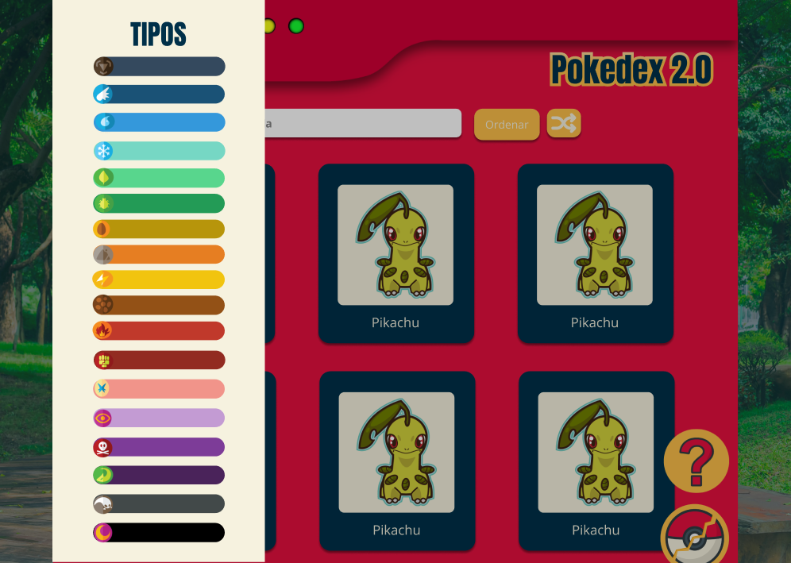
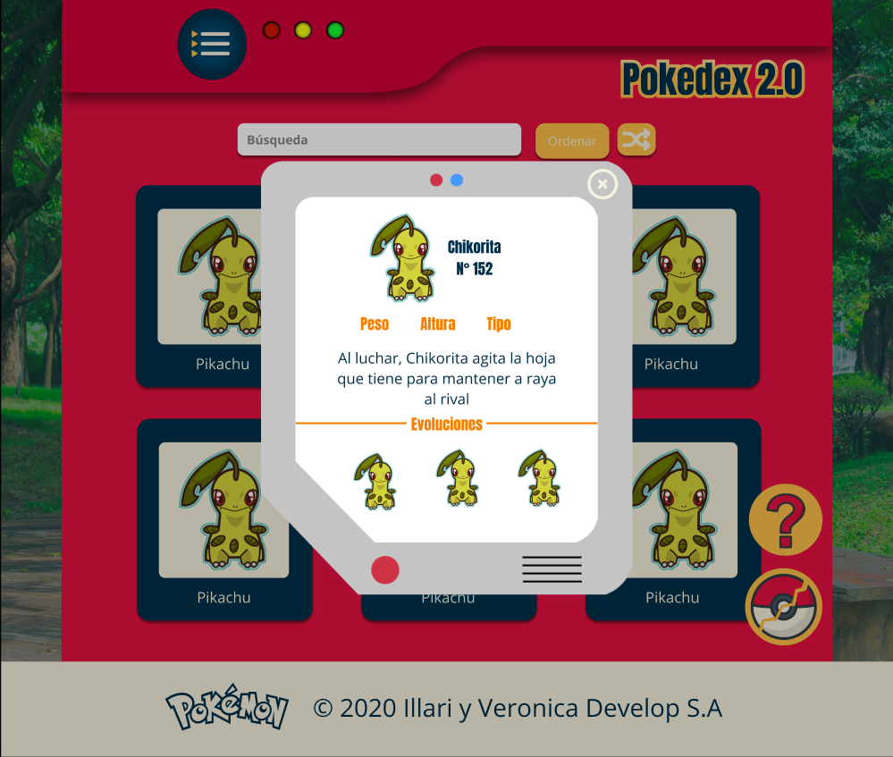
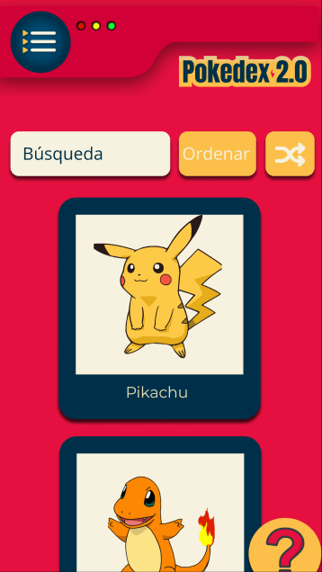
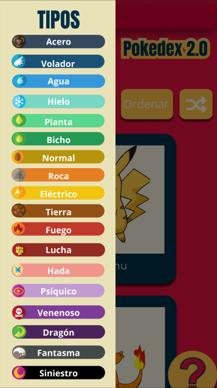
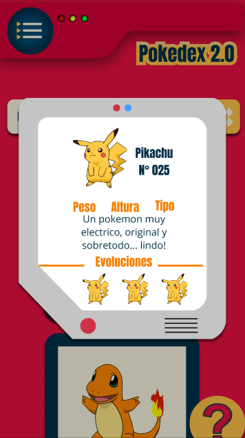

# Pokemon Lovers

## Índice

* [1. Preámbulo](#1-preámbulo)
* [2. Resumen del proyecto](#2-resumen-del-proyecto)
* [3. Nuestros usuarios](#3-nuestros-usuarios)
* [4. Requerimientos de descargas del proyecto](#4-requerimientos-de-descargas-del-proyecto)
* [5. Prototipos y producto final](#5-prototipos-y-producto-final)
* [6. Resúmen del feedback recibido](#6-resumen-feedback)
* [7. Construido con 🛠️](#7-construido-con)
* [8. Autores](#8-autores)
* [9. Gracias 🎁](#9-expresiones-de-gratitud)

## 1. Preámbulo

Pokémon GO es un videojuego de realidad aumentada basado en la localización desarrollado por Niantic​ para dispositivos iOS y Android. Es un videojuego gratuito pero contiene microtransacciones. El juego consiste en buscar y capturar personajes de la saga Pokémon escondidos en ubicaciones del mundo real y luchar con ellos, lo que implica desplazarse físicamente por las calles de la ciudad para progresar. La aplicación comporta un elemento de interacción social, ya que promueve reuniones físicas de los usuarios en distintas ubicaciones de sus poblaciones. 

La aplicación transforma monumentos locales y negocios en gimnasios Pokémon (donde los jugadores entrenan a sus Pokémon y en donde combaten otros equipos) y en Pokeparadas (actualmente hay más de 4.3 millones en todo el mundo), donde los jugadores encuentran accesorios como pokebolas. De este modo promueve que los jugadores salgan a explorar sus alrededores, y los atrae a dichos negocios.

## 2. Resumen del proyecto

La Pokedex 2.0, enfocada en Pokemón Go, brinda a los usuarios la posibilidad de interactuar con los pokemones de las regiones de Kanto y Johto de manera que puedan conocer al más fuerte, ordenarlos alfabéticamente y numéricamente, buscarlos por tipo o incluso con su nombre. De cada uno podrá acceder a más características.

## 3. Nuestros usuarios ¿Quiénes son?

Nuestro usuario tiene conocimientos intermedios sobre Pokemón en general. Ha sido un fiel seguidor desde la infancia y las actualizaciones, en el juego se materializa el sueño de hacer las actividades que hacían los personajes en la serie original como ser maestro pokemon, capturar pokemones, participar en combates en gimnasios, evolucionar pokemones, etc...  Sin embargo, nuestro usuario no participa en concursos de manera profesional, tampoco juega con una frecuencia mayor a 2 horas por día o invierte dinero en el juego habitualmente.
Se dedica a jugar entre amigos o comunidades pequeñas, principalmente como diversión entre sus actividades diarias entre las que podría estar estudiar o trabajar.
Dentro del juego, le es importante las características de los pokemones, el orden de su pokedex y la información que pueda obtener para ganar los combates amistosos.

## 4. Requerimientos de descargas del proyecto

* Es necesario tener un editor de código; el de su preferencia (visual estudio, atom)
* Si su Sistema Operativo es W  indows será necesario la instalación de una interfaz de terminal [UNIX Shell](https://github.com/Laboratoria/bootcamp/tree/master/topics/shell) puedes usar la versión completa de [Cmder](https://cmder.net/)
  que incluye [Git bash](https://git-scm.com/download/win) y si tienes Windows 10
  o superior puedes usar [Windows Subsystem for Linux](https://docs.microsoft.com/en-us/windows/wsl/install-win10).
* Del mismo modo debes tener git instalado.
* Forkea el proyecto.
* Clona tu fork de manera local (en tu compuradora)
* Instala las dependencias del proyecto con el comando npm install. Esto asume que has instalado Node.js (que incluye npm).
* Para ver la interfaz de tu programa en el navegador, usa el comando npm start para arrancar el servidor web y dirígete a http://localhost:5000 en tu navegador.

## 5. Prototipos y producto final

### Prototipo en papel DESKTOP

### Prototipo en papel MOBILE

### Prototipo en Figma DESKTOP

## Prototipo en Figma MOBILE

## 6. Resúmen del feedback recibido 

El feedback en el desarrollo de este proyecto fue pieza clave para la optimización de funciones, maquetaciones y paleta de colores. El prototipo en papel fue planteado de acuerdo a feedback recibido con la idea principal, posteriormente recibimos feedback a través de una encuesta a nuestros usuarios; en los cuales optimizamos la interacción de la página y colores utilizados.
## 7. Construido con 🛠️
JavaScript
CSS3
HTML5
## 8. Autores ✒️

* **Verónica Silva** -[VeroSilva](https://github.com/VeroSilva)
* **Illari Alvarez-Gil Escobar** -[IllariLaksmi](https://github.com/IllariLaksmi)

## 9. Gracias 🎁

* Damos gracias a nuestros familiares y a todos aquellos que nos apoyaron en este proyecto :)

